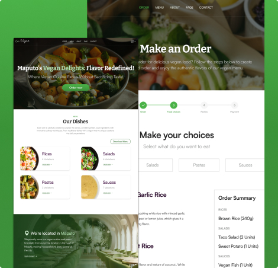

# GoVegan Website

This project originated from my specialization in User Experience Design (UX) at the California Institute of Arts, completed through the Coursera platform. Initially developed as a UI Design project, GoVegan was created to explore innovative solutions that simplify food delivery for a fictional vegan restaurant. Using solid UX principles and extensive research, I aimed to design an intuitive and engaging user experience. Now, I am bringing this design to life in code, with the goal of testing it with users to validate the effectiveness of the solution.

<div style="text-align: center;">
  
</div>

# Preview

You can check the demo app [here](https://goveganapp.fausiopaco.co.mz)

## Table of Contents

1. [Features](#features)
2. [Tech Stack](#tech-stack)
3. [Installation](#installation)
4. [Usage](#usage)
5. [Testing](#testing)
6. [Contributing](#contributing)

## Features

- Browse a menu of delicious vegan dishes.
- Simulate Order food for delivery in Maputo.
- User-friendly and responsive UI, optimized for both desktop and mobile.
- Simulate order preview.

## Tech Stack

- **Frontend**: HTML, CSS, JavaScript, React, Tailwind CSS
- **Testing**: Vitest

## Installation

1. Clone the repository:

   ```bash
   git clone https://github.com/FausioPaco/GoVegan.git
   ```

2. Navigate to the project directory:

   ```bash
   cd go-vegan
   ```

3. Install dependencies:

   ```bash
   pnpm install
   ```

4. Start the development server:

   ```bash
   pnpm dev
   ```

## Usage

1. Open the GoVegan app in your browser.
2. Browse through the menu and select items you’d like to order.
3. View cart and order details in real-time.
4. Complete the order process and provide delivery details for testing.

## Testing

This project uses **Vitest** for unit and integration testing.

To run the tests:

```bash
pnpm test
```

## Contributing

If you would like to contribute:

1. Fork the repository.
2. Create a new branch for your feature/bug fix.
3. Commit your changes.
4. Open a pull request.
